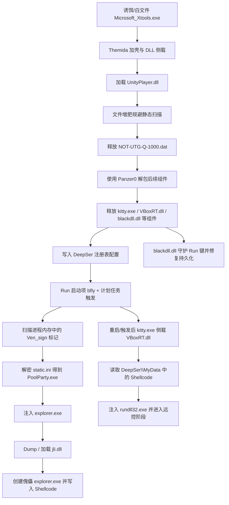

## 一、 概述

本报告针对近期捕获的一例“银狐”木马最新变种进行了深度分析 。在此次攻击活动中，攻击者展现了极高的防御规避意识，不仅利用 Themida 加壳与“文件增肥”（File Padding）技术对抗静态查杀，还广泛采用了“白加黑”侧载机制 。在载荷执行阶段，该变种运用了罕见且高级的 PoolParty 进程注入技术，通过劫持 Windows 线程池隐蔽地将恶意代码注入系统核心进程，最终实现对目标系统的深度控制与持久化 。

## 二、样本信息

### 2.1 文件 IOC

| 文件名                    | SHA1                                       | 说明                                             |
| ---------------------- | ------------------------------------------ | ---------------------------------------------- |
| `UnityPlayer.dll`      | `c00000f0feedc9528f96f6624f562459c037daaf` | 第一阶段核心组件，体积约 209 MB，疑似通过文件增肥规避大文件扫描            |
| `VBoxRT.dll`           | `ceed164619b274410c1bac27b5f4d9b88fb8c4bf` | 第二阶段恶意载荷，由 `kitty.exe` 侧载                      |
| `blackdll.dll`         | `b3caf1a617681c0df30cae15f868ba2c42309f65` | 守护 / 修复持久化链相关模块                                |
| `Microsoft_Xtools.exe` |                                            | 第一阶段白文件 / 诱饵宿主，Themida 加壳，侧载 `UnityPlayer.dll` |
| `kitty.exe`            |                                            | 第二阶段白文件 / 宿主程序，侧载 `VBoxRT.dll`                 |
| `NOT-UTG-Q-1000.dat`   |                                            | 加密压缩包，使用 `Panzer0` 解密后释放后续组件                   |
| `static.ini`           |                                            | 被解密为 `PoolParty.exe` 的资源或载荷容器                  |
| `PoolParty.exe`        |                                            | 线程池注入模块，目标为 `explorer.exe`                     |
| `jli.dll`              |                                            | 从被注入进程内存中 Dump 出的后续模块                          |

### 2.2 主机侧 IOC

| 类型      | IOC / 线索                                             | 说明                                          |
| ------- | ---------------------------------------------------- | ------------------------------------------- |
| 注册表     | `HKEY_USERS\...\Software\DeepSer`                    | 恶意配置主键，公开相似样本也大量出现                          |
| 注册表值    | `MyData`                                             | 存储 Shellcode、加密载荷或载荷路径，例如 `\view.res`       |
| 注册表值    | `OpenAi_Service`                                     | 存储宿主或白文件路径；这里是攻击者自定义键名                      |
| 注册表值    | `Onload1`                                            | 存储初始程序 `Microsoft_Xtools.exe` 路径            |
| 注册表启动项  | `Software\Microsoft\Windows\CurrentVersion\Run\bfly` | 指向 `kitty.exe`，用于登录自启动                      |
| 文件路径    | `%APPDATA%\Roaming\<随机值>\NOT-UTG-Q-1000.dat`         | 加密压缩包落地位置                                   |
| 文件 / 资源 | `\view.res`                                          | `MyData` 指向的载荷数据或资源文件                       |
| 内存标记    | `Ven_sign` / `avenSign`                              | 注入后写入目标进程的标记，疑似用于防重复感染或执行状态识别               |
| 目标进程    | `explorer.exe`                                       | 线程池注入和后续傀儡进程链的主要目标                          |
| 目标进程    | `rundll32.exe`                                       | 第二阶段 `VBoxRT.dll` 从注册表读取 Shellcode 后注入的宿主进程 |

## 三、攻击链



## 四、分阶段分析

### 4.1 第一阶段：白文件侧载与文件增肥

攻击链从一个带有 Themida 保护壳的白文件 `Microsoft_Xtools.exe` 开始 ，该程序启动后侧载同目录下的恶意动态库`UnityPlayer.dll`。

攻击者运用了“文件增肥”（File Padding）技术，在 `UnityPlayer.dll` 的代码尾部追加大量无效数据，使其体积暴增至 209 MB 。这一策略旨在规避了部分安全产品的大文件扫描阈值或拖慢静态分析。

### 4.2 武器库解包

`UnityPlayer.dll` 运行后，在 `%APPDATA%\Roaming\<随机值>\` 下释放加密压缩包 `NOT-UTG-Q-1000.dat`，并使用内置明文密码 `Panzer0` 解包。


解包后释放的核心组件包括：


| 组件 | 作用研判 |
| --- | --- |
| `kitty.exe` | 第二阶段宿主 / 白文件，用于侧载 `VBoxRT.dll` |
| `VBoxRT.dll` | 第二阶段恶意 DLL，读取注册表 Shellcode 并注入 `rundll32.exe` |
| `blackdll.dll` | 守护模块，负责检查并恢复启动项 |
| `static.ini` | 加密或编码的载荷容器，解密后得到 `PoolParty.exe` |
| `PoolParty.exe` | 负责线程池注入的模块 |

### 4.3 注册表配置与双重持久化网络

样本会创建或使用 `HKEY_USERS\...\Software\DeepSer`，并写入多项配置。

| 键值名              | 原文观察                         | 研判                         |
| ---------------- | ---------------------------- | -------------------------- |
| `MyData`         | 存储 `\view.res` 或载荷数据         | 更准确地说是 Shellcode / 加密载荷缓存区 |
| `OpenAi_Service` | 存储 `kitty.exe` 路径            | 宿主路径缓存，`kitty.exe` 的路径     |
| `Onload1`        | 存储 `Microsoft_Xtools.exe` 路径 | 初始链路路径缓存，用于恢复或二次触发         |


双触发持久化：

1. 计划任务：读取注册表中的路径后，调用 `RegisterScheduledTaskWithPath` 或相关计划任务逻辑注册任务。


2. Run 启动项：将 `kitty.exe` 写入 `Software\Microsoft\Windows\CurrentVersion\Run`，键名为 `bfly`。


### 4.4 内存特征嗅探`Ven_sign`：互斥 / 标记 / 防重复执行

样本创建进程快照并遍历进程内存，查找 `Ven_sign` 字符串。后续注入傀儡进程时，又出现：

```c
WriteProcessMemory(hProcess, v6, avenSign, 9uLL, 0LL)
```

`Ven_sign` 是样本写入目标进程内存的执行标记，可能用于防重复感染、识别已注入进程，或判断当前链路是否已经完成。


### 4.5 PoolParty 线程池注入

样本加载并解密 `static.ini`，得到 `PoolParty.exe`，随后针对 `explorer.exe` 进行线程池注入。


使用的是 PoolParty Variant 7：先定位 `explorer.exe`，复制目标进程中的 `IoCompletion` 句柄，再通过 `ZwSetIoCompletion` 投递 `TP_DIRECT` 结构触发执行。

- 调用 `ZwDuplicateObject` / `DuplicateHandle` 复制 `explorer.exe` 句柄。
- 调用 `ZwQueryObject`，并比较对象类型名 `IoCompletion`。
- 构造或写入 `TP_DIRECT` 风格结构。
- 调用 `ZwSetIoCompletion` / `NtSetIoCompletion` 向目标 I/O completion queue 投递任务。

### 4.6 `jli.dll`线程劫持与傀儡 `explorer.exe`

注入 `explorer.exe` 后，可以从内存中 Dump 出 `jli.dll`。


该模块随后启动新的：

```text
CommandLine=C:\Windows\explorer.exe
```

并将恶意 Shellcode 写入其中执行。


### 4.7 第二阶段：`kitty.exe` 侧载 `VBoxRT.dll`

系统重启、登录或计划任务触发后，`kitty.exe` 启动并侧载 `VBoxRT.dll`。


`VBoxRT.dll` 从 `Software\DeepSer\MyData` 读取隐藏 Shellcode，并注入`rundll32.exe`。


`blackdll.dll` 负责守护启动项，如果 `Run\bfly` 被删除，会尝试重新写入，构成持久化修复链。


## MITRE ATT&CK 映射

| 战术        | 技术 ID     | 技术名称                                                  | 样本映射                                                                    |
| --------- | --------- | ----------------------------------------------------- | ----------------------------------------------------------------------- |
| 执行        | T1204.002 | 用户执行：恶意文件（User Execution: Malicious File）             | 用户运行伪装程序 `Microsoft_Xtools.exe`                                         |
| 执行 / 持久化  | T1053.005 | 计划任务（Scheduled Task）                                  | 注册计划任务触发后续载荷                                                            |
| 持久化       | T1547.001 | 登录自启动：注册表 Run 键（Registry Run Keys）                    | 写入 `Run\bfly` 指向 `kitty.exe`                                            |
| 防御规避      | T1574.002 | 执行流劫持：DLL 侧载（DLL Side-Loading）                        | `Microsoft_Xtools.exe` 侧载 `UnityPlayer.dll`，`kitty.exe` 侧载 `VBoxRT.dll` |
| 防御规避      | T1027.001 | 二进制填充（Binary Padding）                                 | `UnityPlayer.dll` 文件增肥至约 209 MB                                         |
| 防御规避      | T1027.002 | 软件加壳（Software Packing）                                | `Microsoft_Xtools.exe` 使用 Themida 加壳                                    |
| 防御规避      | T1140     | 解码 / 解密文件或信息（Deobfuscate/Decode Files or Information） | 使用 `Panzer0` 解包 `NOT-UTG-Q-1000.dat`                                    |
| 防御规避      | T1112     | 修改注册表（Modify Registry）                                | 创建 `Software\DeepSer` 并写入 `MyData`、`OpenAi_Service`、`Onload1`           |
| 发现        | T1057     | 进程发现（Process Discovery）                               | 创建进程快照并遍历进程                                                             |
| 防御规避 / 执行 | T1055     | 进程注入（Process Injection）                               | PoolParty 线程池注入 `explorer.exe`，以及 `VBoxRT.dll` 注入 `rundll32.exe`        |
| 命令与控制     | T1071     | 应用层协议（Application Layer Protocol）                     | 后续远控通信待从 Shellcode / 网络流量中确认                                            |
| 命令与控制     | T1105     | 工具传入（Ingress Tool Transfer）                           | 若确认后续从 C2 拉取插件或载荷，可映射                                                   |

## 参考来源

- [Fortinet: SEO Poisoning Attack Targets Chinese-Speaking Users with Fake Software Sites](https://www.fortinet.com/blog/threat-research/seo-poisoning-attack-targets-chinese-speaking-users-with-fake-software-sites)
- [Rapid7: NSIS Abuse and sRDI Shellcode: Anatomy of the Winos 4.0 Campaign](https://www.rapid7.com/blog/post/2025/05/22/nsis-abuse-and-srdi-shellcode-anatomy-of-the-winos-4-0-campaign/)
- [Cybereason: Fake Installer: Ultimately, ValleyRAT infection](https://www.cybereason.com/blog/fake-installer-valleyrat?hs_amp=true)
- [SafeBreach: Process Injection Using Windows Thread Pools](https://www.safebreach.com/blog/process-injection-using-windows-thread-pools/)
- [瑞星：银狐木马服务端探索及近期在野样本分析](https://rayblog.rising.com.cn/2025/01/%E9%93%B6%E7%8B%90%E6%9C%A8%E9%A9%AC%E6%9C%8D%E5%8A%A1%E7%AB%AF%E6%8E%A2%E7%B4%A2%E5%8F%8A%E8%BF%91%E6%9C%9F%E5%9C%A8%E9%87%8E%E6%A0%B7%E6%9C%AC%E5%88%86%E6%9E%90/)
- [安天：游蛇投毒攻击分析](https://www.antiy.com/response/SwimSnake_Analysis_202508.html)
