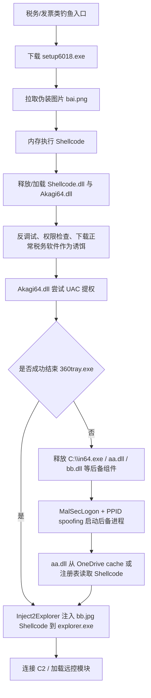

## 一、前言

本报告针对一例银狐木马样本进行了深度分析。该攻击活动以钓鱼诱饵作为初始突破口，其核心载荷大量运用了无文件内存加载、白加黑伪装、Restart Manager 强杀杀软、以及多重进程注入与父进程伪造（Spoof PID）等高级防御规避（Defense Evasion）技术。最终目的是将 C2 控制模块注入系统核心进程，实现对受控终端的长期远程控制。

## 二、样本信息

### 2.1 样本文件

| 文件名             | MD5                                | 说明                         |
| --------------- | ---------------------------------- | -------------------------- |
| `setup6018.exe` | `da5a13a58e66c99c0ff4fbc6f998c9e`  | 初始下载器 / 投递器                |
| `bai.png`       | `a9b77193d11deb202813106f4c0f0b9`  | 伪装为图片的 Shellcode           |
| `bb.jpg`        | `a984f9693da68b9579a8a0755591cb8`  | 伪装为图片的 C2 / 后续载荷 Shellcode |
| `aa.dll`        | `206e912da49cbd0e4f8c8bebe3988047` | 后备流程中的寻址与注入模块              |
### 2.2 主机侧 IOC

| 类型    | IOC / 线索                                                                                    | 用途                                      |
| ----- | ------------------------------------------------------------------------------------------- | --------------------------------------- |
| 注册表   | `HKEY_CURRENT_USER\Console\huorong*`                                                        | 写入或读取 Shellcode 数据，键名由 `huorong` 加随机值构成 |
| 文件路径  | `C:\OneDrive\cache\bb.jpg`                                                                  | `aa.dll` 优先读取的后续载荷路径                    |
| 文件路径  | `C:\in64.exe`、`C:\in.exe`、`C:\aa.dll`、`C:\bb.dll`、`C:\MSNDetourDLL_X64.dll`、`C:\rundll.dll` | 未能成功结束 360 进程时释放的后备组件                   |
| 目标进程  | `360tray.exe`                                                                               | 被 Restart Manager 逻辑识别并尝试结束             |
| 注入目标  | `explorer.exe`                                                                              | 用于承载 `bb.jpg` 中的 Shellcode              |
| 关键组件名 | `Akagi64.dll`、`Shellcode.dll`、`Overwatch.exe`、`active_desktop_render_x64.dll`               | `bai.png` 解包后的组件名                       |
| 导出函数  | `hanshu`                                                                                    | `Shellcode.dll` 的主要执行入口                 |
## 三、攻击链重构

### 3.1 初始投递

攻击者使用税务、发票、申报升级等主题作为诱饵，引导受害者下载并执行 `setup6018.exe`。该文件不直接暴露完整远控功能，而是作为下载器从远端拉取伪装为图片的 `bai.png`。

### 3.2 `bai.png` 内存加载与组件释放

`bai.png` 不是正常图片，而是伪装后缀的 Shellcode，由开源工具 DllToShellCode（killeven/DllToShellCode） 将一个或多个恶意 DLL 转换成位置无关、可直接内存执行的二进制流。Shellcode 在内存中解析并装载后续模块，减少磁盘落地痕迹。后缀改为 .png 伪装，绕过文件类型检测。

解包后可见 4 个主要组件：

| 组件 | 作用研判 |
| --- | --- |
| `Shellcode.dll` | 主执行模块，通过导出函数 `hanshu` 进入核心逻辑 |
| `Akagi64.dll` | 疑似 UACMe / Akagi 相关提权组件 |
| `Overwatch.exe` | 原始分析中未观察到后续关键行为，暂列为辅助或冗余组件 |
| `active_desktop_render_x64.dll` | 原始分析中未观察到后续关键行为，暂列为辅助或冗余组件 |

### 3.3 环境探测与诱饵掩护

`Shellcode.dll` 通过导出函数 `hanshu` 启动主要逻辑。

执行初期会检查当前进程是否处于调试状态，用于提高分析成本。

同时，也会判断当前权限是否为管理员权限。

随后样本调用 `InternetOpenUrlW` 下载并执行正常税务开票软件。这一策略以合法软件为诱饵，起到了极好的行为掩护作用 。

### 3.4 权限提升

调用 `Akagi64.dll` 尝试提权，如果提权失败，样本会短暂休眠后退出；如果提权成功，则进入安全产品检测与对抗阶段。

### 3.5 杀软对抗

针对 `360tray.exe` 使用 Windows Restart Manager 服务来管理 `360tray.exe` 资源，一旦发现该进程存在便将其强行结束 。

如果对 `360tray.exe` 的结束逻辑成功，样本会执行 `Inject2Explorer`，把 `bb.jpg`（C2 Shellcode）中的 Shellcode 注入 `explorer.exe`（Windows Shell 进程 / 常驻用户交互进程）。

后续，该 Shellcode 会尝试连接攻击者控制的 C2 并进入远控阶段。

如果未能成功结束 360 进程，样本会释放一批后备组件到 C 盘根目录：

- `in64.exe`
- `in.exe`
- `aa.dll`
- `bb.dll`
- `MSNDetourDLL_X64.dll`
- `rundll.dll`

程序随后尝试通过 `in.exe`、`MSNDetourDLL_X64.dll`、`rundll.dll` 加载相关 DLL。若常规加载失败，则退而使用命令行方式强制执行。

在启动新进程时，样本使用 MalSecLogon 思路并结合Spoof PID（父进程欺骗），把新进程的父进程伪装为 `explorer.exe`，以此躲避进程链监控。

(*MalSecLogon是开源工具，用于滥用 Windows Seclogon（Secondary Logon，辅助登录）服务，实现**PPID 欺骗**与**LSASS 进程内存转储**，属于**凭证窃取 / 权限维持**类红队工具。*)

在该后备流程中，`aa.dll` 负责寻找并加载后续 Shellcode。它先尝试从 `\OneDrive\cache` 路径读取 `bb.jpg`：

如果文件读取失败，则转向注册表 `HKEY_CURRENT_USER\Console`，读取此前写入的 `huorong*` 键值数据：

获取载荷后，`aa.dll` 仍会尝试将其注入 `explorer.exe` 执行：

### 3.6 载荷暂存

样本会将一段 Shellcode 写入注册表 `HKEY_CURRENT_USER\Console`，键名由 `huorong` 拼接随机值构成。

### 3.7 C2模块

样本内部存在 6001 至 6007 等编号化 Shellcode 资源项，每个编号对应一段内嵌 Shellcode 数据。部分 Shellcode 尾部附带明文配置区，可见 6002.baidu787.com 等域名，疑似为后续远控模块使用的 C2 节点。6001/6002 既可能是模块编号，也可能被复用为 C2 子域名分组。

## MITRE ATT&CK 映射

| 战术          | 技术 ID     | 技术名称                                                     | 样本映射                                                  |
| ----------- | --------- | -------------------------------------------------------- | ----------------------------------------------------- |
| 初始访问        | T1566     | 网络钓鱼（Phishing）                                           | 税务/发票/申报类钓鱼入口                                         |
| 执行          | T1204.002 | 用户执行：恶意文件（User Execution: Malicious File）                | 用户执行 `setup6018.exe`                                  |
| 执行          | T1059.003 | 命令与脚本解释器：Windows 命令行（Windows Command Shell）              | 后备流程中通过命令行强制加载组件                                      |
| 防御规避        | T1027.013 | 加密或编码文件（Encrypted/Encoded File）                          | `bai.png`、`bb.jpg` 以图片后缀伪装 Shellcode                  |
| 防御规避        | T1036     | 伪装（Masquerading）                                         | 使用正常税务软件作为诱饵掩护                                        |
| 防御规避        | T1620     | 反射式代码加载（Reflective Code Loading）                         | Shellcode 在内存中加载 DLL / PE 组件                          |
| 防御规避        | T1622     | 调试器规避（Debugger Evasion）                                  | 执行早期进行反调试检查                                           |
| 防御规避        | T1562.001 | 削弱防护：禁用或修改安全工具（Impair Defenses: Disable or Modify Tools） | 通过 Restart Manager 尝试结束 `360tray.exe`                 |
| 权限提升        | T1548.002 | 绕过用户账户控制（Bypass User Account Control）                    | `Akagi64.dll` 疑似 UAC 提权组件                             |
| 发现          | T1518.001 | 安全软件发现（Security Software Discovery）                      | 检测 360 等安全产品进程                                        |
| 防御规避        | T1112     | 修改注册表（Modify Registry）                                   | 将 Shellcode 数据写入 `HKEY_CURRENT_USER\Console\huorong*` |
| 防御规避 / 权限提升 | T1134.004 | 父进程 ID 欺骗（Parent PID Spoofing）                           | 后备流程中伪造父进程为 `explorer.exe`                            |
| 防御规避 / 执行   | T1055     | 进程注入（Process Injection）                                  | 将 `bb.jpg` 中的 Shellcode 注入 `explorer.exe`             |
| 命令与控制       | T1071     | 应用层协议（Application Layer Protocol）                        | 后续 Shellcode 连接 C2 并加载远控模块，具体协议待提取                    |
| 命令与控制       | T1105     | 工具传入（Ingress Tool Transfer）                              | `setup6018.exe` 拉取 `bai.png`，后续载荷继续下载                 |

## 参考来源

- [Fortinet: A Deep Dive into a New ValleyRAT Campaign Targeting Chinese Speakers](https://www.fortinet.com/blog/threat-research/valleyrat-campaign-targeting-chinese-speakers)
- [Rapid7: NSIS Abuse and sRDI Shellcode: Anatomy of the Winos 4.0 Campaign](https://www.rapid7.com/blog/post/2025/05/22/nsis-abuse-and-srdi-shellcode-anatomy-of-the-winos-4-0-campaign/)
- [Fortinet: Massive Winos 4.0 Campaigns Target Taiwan](https://www.fortinet.com/uk/blog/threat-research/massive-winos-40-campaigns-target-taiwan)
- [Check Point Research: Chasing the Silver Fox: Cat & Mouse in Kernel Shadows](https://research.checkpoint.com/2025/silver-fox-apt-vulnerable-drivers/)
- [CyCraft: Taiwan Tax Filing Alert: Silver Fox Targets Users with Winos 4.0 Spear Phishing](https://www.cycraft.com/en/post/winos-rat-en-20260427)
